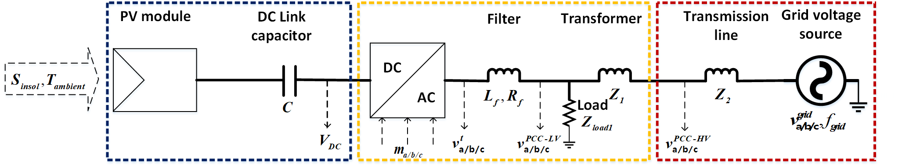

**Status:** Maintenance (expect bug fixes and minor updates)
# Gym environment for PV-DER

Solar photovoltaic distributed energy resources (PV-DER) are power electronic inverter based generation (IBG) connected to the electric power distribution system (eg. roof top solar PV systems). This environment consists of a single DER connected to a stiff voltage source as shown in the following schematic:



## Basics
The dynamics of the DER are modelled using dynamic phasors. One step is equivalent to one cycle (0.016 s).
## Installation
First install the [Solar PVDER simulation utility.](https://github.com/sibyjackgrove/SolarPV-DER-simulation-utility) Then you can install the PVDER environment using following commands:
```
git clone https://github.com/sibyjackgrove/gym-SolarPVDER-environment.git
cd gym-SolarPVDER-environment
pip install -e .
```
Other dependencies: OpenAI Gym, Numpy, SciPy
## Using the environment
The environment can be instantiated just like any other OpenAI Gym environment as show below:
```
import gym
import gym_PVDER
env = gym.make('PVDER-v0')
```
Try it out in Google Colab:

[](https://colab.research.google.com/github/sibyjackgrove/gym-SolarPVDER-environment/blob/master/examples/gym_PVDER_environment_import_test.ipynb)

The environment can also be used with TensorFlow agents. Try out the demo below which trains a DQN agent using the environment:

[](https://colab.research.google.com/github/sibyjackgrove/gym-SolarPVDER-environment/blob/master/examples/gym_PVDER_environment_tf_agents_DQN_demo.ipynb)
## Citation
If you use this code please cite it as:
```
@misc{gym-PVDER,
  title = {{gym-SolarPVDER-environment}: A environment for solar photovoltaic distributed energy resources},
  author = "{Siby Jose Plathottam}",
  howpublished = {\url{https://github.com/sibyjackgrove/gym-SolarPVDER-environment}},
  url = "https://github.com/tensorflow/agents",
  year = 2019,
  note = "[Online; accessed 18-March-2019]"
}
```
